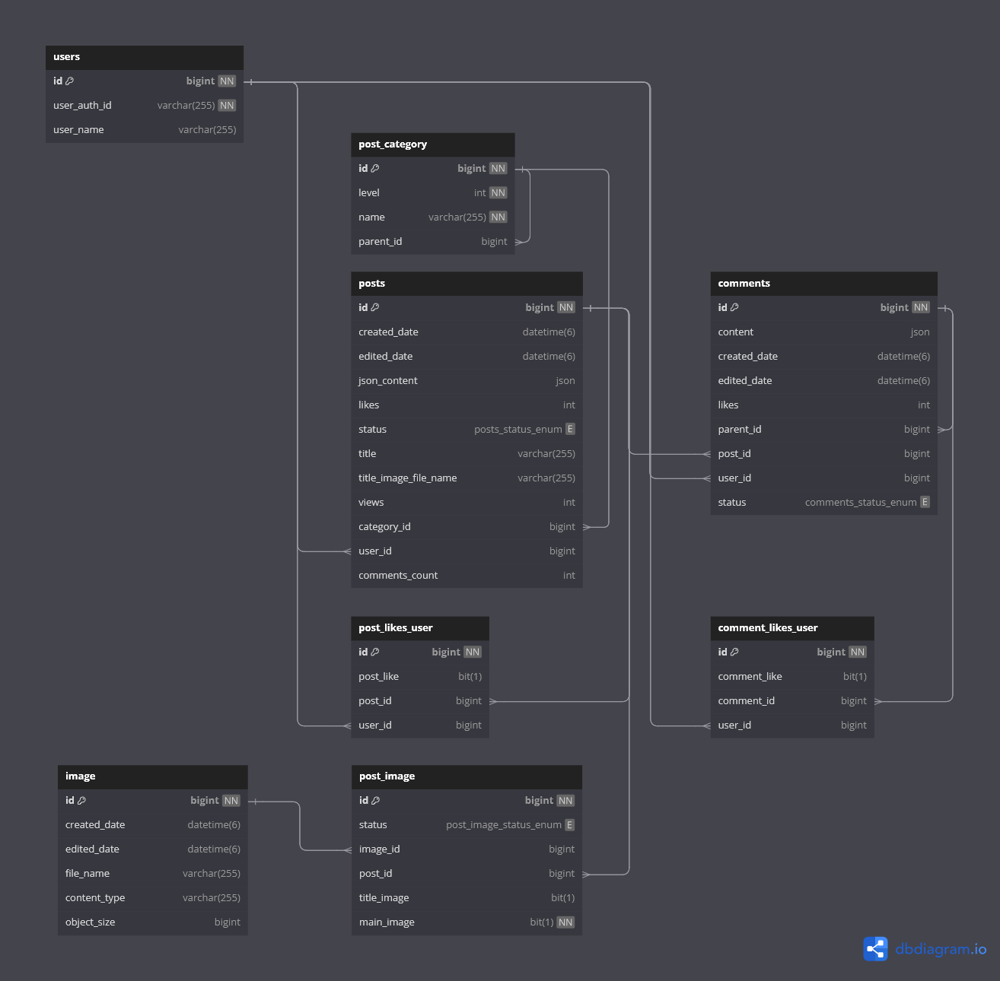

# 침하하 클론 웹 애플리케이션 - 백엔드

## 주요 기능

 - 전체 게시글 목록 조회
 - 게시글 DB 연동, 이미지 처리
 - 댓글 및 답글 DB 연동, 데이터 전달
 - 좋아요 처리

## ERD 구성
 
  
 

### 전체 게시글 목록 조회

- Post 작성이 끝나면 첫 번재 이미지 사이즈를 줄여 게시글 목록에 표시할 썸네일 이미지로 변환합니다.

### 게시글 DB 연동
  - 검증 확인  
    PostService 객체 내 validate... 메소드에서 데이터를 검증합니다.  
  - CRUD 처리  
    권한이 있는 이용자이고, 누락된 데이터가 없을 경우 DB 에 저장, 수정, 삭제 명령을 처리합니다.  
  - 게시글에 첨부되는 이미지 처리  
    - 게시글에 첨부되는 이미지는 작성 중에 임시로 minio 객체 스토리지에 저장되며, 동시에 메타 데이터를 DB에 저장합니다.  
    - 저장되는 이미지 이름은 무작위로 생성됩니다.(영어 대소문자, 숫자로 구성)  
    - 게시글 작성이 완료되면 게시글에 첨부된 이미지만 특정 테이블(post_image)에 등록되며, 등록되지 않은 임시 이미지는 24시간이 지나면 일정 시간(현재 6시간)마다 실행되는 스케줄러에 의해 삭제됩니다. 
    - 게시글이 수정되거나 삭제되면 첨부된 이미지도 DB 와 객체 스토리지에서 삭제됩니다.  
    - 게시글에 이미지가 첨부되었다면 게시글 첫 번째 이미지가 썸네일 이미지가 됩니다.
    - 썸네일 이미지가 너무 크거나 썸네일 화면비에 맞지 않다면 사이즈를 축소하고 잘라냅니다.  
    - 썸네일 이미지는 게시글 이미지와는 다른 버킷에 저장되며, 게시글이 수정, 삭제될 때 변경되거나 삭제됩니다.  
  - 조회수 처리  
    - 짧은 시간 내에 호출이 많을 수 있는 조회수 증가 로직은 redis 서버를 경유해 일정 시간 간격을 두고 업데이트합니다.  

### 댓글 및 답글 DB 연동, 데이터 전달
  - 검증 확인  
    - CommentService 객체 내 validate... 메소드에서 데이터를 검증합니다.  
  - CRUD 처리 
    - 권한이 있는 이용자이고, 누락된 데이터가 없을 경우 DB 에 저장, 수정, 삭제 명령을 처리합니다. 
    - CRUD 결과는 해당 댓글 및 하위 답글 DTO 객체가 응답값으로 전달됩니다.  
  - 데이터 전달 
    - 특정 게시글의 모든 댓글은 게시글 ID를 외래키로 가지고 있으며, 모든 답글은 댓글 ID를 외래키로 가지고 있습니다. 
    - 게시글 Id 로 DB 에서 댓글 및 답글 데이터를 한번에 불러오고 DTO 생성자에서 댓글 및 답글 연관관계를 매핑합니다.  

### 좋아요 처리
  - 좋아요 처리  
    - 유저당 게시글별 좋아요 횟수는 1회로 제한됩니다. 
    - 좋아요 재요청 시 좋아요는 취소됩니다. 
  

